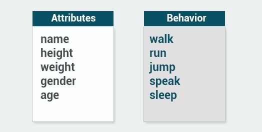
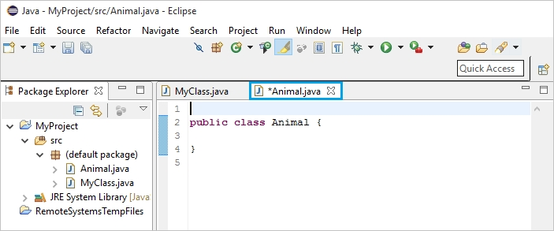

<p>
    GitHub: <a href="https://github.com/dark-teal-coder">@dark-teal-coder</a>
    <br />
    First Published Date: 2024-03-08
    <br />
    Last Modified Date: 2024-04-21
</p>

&nbsp;

---

&nbsp;

# Java Intermediate

Time to get serious and really see what Java (and you!) can do! In this course you’ll learn some concepts related to Object-Oriented Programming (OOP), Collections, and working with files. You’ll be a pro in no time!

&nbsp;

---

&nbsp;

## Table of Contents

- [Module 01: Classes and Objects](https://github.com/dark-teal-coder/course-sololearn-java-intermediate/blob/main/course-note-sololearn-java-intermediate.md#module-01-classes-and-objects)
- [Module 02: More on Classes](https://github.com/dark-teal-coder/course-sololearn-java-intermediate/blob/main/course-note-sololearn-java-intermediate.md#module-02-more-on-classes)
- [Module 03: Exceptions, Lists, Threads & Files](https://github.com/dark-teal-coder/course-sololearn-java-intermediate/blob/main/course-note-sololearn-java-intermediate.md#module-03-exceptions-lists-threads--files)

&nbsp;

---

&nbsp;

## Module 01: Classes and Objects

### Lesson 01.01: Object-Oriented Programming

#### Object-Orientation

Java uses Object-Oriented Programming (OOP), a programming style that is intended to make thinking about programming closer to thinking about the real world.

In OOP, each object is an independent unit with a unique identity, just as objects in the real world are.

> :warning: An apple is an object; so is a mug. Each has its unique identity. It's possible to have two mugs that look identical, but they are still separate, unique objects.

Objects also have characteristics, which are used to describe them.

For example, a car can be red or blue, a mug can be full or empty, and so on. These characteristics are also called attributes. An attribute describes the current state of an object.

In the real world, each object behaves in its own way. The car moves, the phone rings, and so on.

The same applies to objects: behavior is specific to the object's type.

> :warning: In summary, in object oriented programming, each object has three dimensions: identity, attributes, and behavior. <br/> Attributes describe the object's current state, and what the object is capable of doing is demonstrated through the object's behavior.

#### Classes

A class describes what the object will be, but is separate from the object itself.

In other words, classes can be described as blueprints, descriptions, or definitions for an object. You can use the same class as a blueprint for creating multiple objects. The first step is to define the class, which then becomes a blueprint for object creation.

Each class has a name, and each is used to define attributes and behavior.

Some examples of attributes and behavior:

<p align="center">
    
</p>

> :warning: In other words, an object is an instance of a class.

#### Quiz 01.01.01

**Question**

A class defines _____ and _____.

Select all correct answers (choose 2).

- [ ] values
- [ ] apples
- [ ] behaviors
- [ ] attributes

**Answer**

- [ ] values
- [ ] apples
- [x] behaviors
- [x] attributes

### Lesson 01.02: Creating Classes & Objects

#### Creating Classes

In order to create your own custom objects, you must first create the corresponding classes. This is accomplished by right clicking on the `src` folder in Eclipse and selecting [Create] -> [New] -> [Class]. Give your class a name and click Finish to add the new class to your project:

<p align="center">
    
</p>

As you can see, Eclipse has already added the initial code for the class.

Now let's create a simple method in our new class.

Animal.java

```java
public class Animal {
	void bark() {
		System.out.println("Woof-Woof");
	}
}
```

We declared a bark() method in our Animal class.

> :warning: Now, in order to use the class and it's methods, we need to declare an object of that class.

#### Quiz 01.02.01

**Question**

Fill in the blanks to create a class with a single method called "test".

```java
public _____ A {
	public void _____() {
		System.out.println("Hi");
	}
}
```

**Answer**

`class` and `test`

```java
public class A {
	public void test() {
		System.out.println("Hi");
	}
}
```

#### Creating Objects

Let's head over to our main and create a new object of our class.

`MyClass.java`

```java
public class Animal {
	void bark() {
		System.out.println("Woof-Woof");
	}
}

class MyClass {
	public static void main(String[ ] args) {
		Animal dog = new Animal();
		dog.bark();
	}
}
```

Now, `dog` is an object of type `Animal`. Thus, we can call its `bark()` method, using the name of the object and a dot.

The dot notation is used to access the object's attributes and methods.

> :warning: You have just created your first object!

##### Creating Classes & Objects

###### Creating Classes & Objects

Create a program to show loading message to your application users.

Define a class Loading which has one public method called `loadingMessage()`, which should print "Loading" when called.

Create an object named loading and call that method.

> :warning: Don't forget to use new keyword while creating an object.

###### Solution

```java
public class Main {
	public static void main(String[] args) {
		Loading loading = new Loading();         
		loading.LoadingMessage();
	}
}

class Loading {
	public static void loadingMessage(){
		System.out.println("Loading");
	}
}
```

#### Quiz 01.02.02

**Question**

Fill in the blanks to create an object of the A class in the B class and call its "test" method.

```java
public _____ A {
	public void test() {
		System.out.println("Hi");
	}
}
class B {
	public static void main(String args[ ]) {
		_____ obj = _____ A();
		obj._____;
	}
}
```

**Answer**

`class`, `A`, `new` and `test()`

```java
public class A {
	public void test() {
		System.out.println("Hi");
	}
}
class B {
	public static void main(String args[ ]) {
		A obj = new A();
		obj.test();
	}
}
```

### Lesson 01.03: Class Attributes

#### Defining Attributes

A class has attributes and methods. The attributes are basically variables within a class.

Let's create a class called `Vehicle`, with its corresponding attributes and methods.

```java
public class Vehicle {
	int maxSpeed;
	int wheels;
	String color;
	double fuelCapacity;  
	
	void horn() {
		System.out.println("Beep!");
	}
}
```

`maxSpeed`, `wheels`, `color`, and `fuelCapacity` are the attributes of our `Vehicle` class, and `horn()` is the only method.

> :warning: You can define as many attributes and methods as necessary.

#### Quiz 01.03.01

**Question**

Drag and drop from the options below to define a class with these attributes: `age` of type integer, `height` as a double, and `name` as a string.

```java
_____ Person {
	_____ age;
	_____ height;
	_____ name;
}
```

- `String`
- `class`
- `void`
- `define`
- `attribute`
- `int`
- `double`

**Answer**

1. `class`
2. `int`
3. `double`
4. `String`

```java
class Person {
	int age;
	double height;
	String name;
}
```

#### Creating Objects

Next, we can create multiple objects of our Vehicle class, and use the dot syntax to access their attributes and methods.

```java
public class Vehicle {
	int maxSpeed;
	int wheels;
	String color;
	double fuelCapacity;  
	
	void horn() {
		System.out.println("Beep!");
	}
}

class MyClass {
	public static void main(String[ ] args) {
		Vehicle v1 = new Vehicle();
		Vehicle v2 = new Vehicle();
		v1.color = "red";
		v2.horn();
	}
}
```

> :warning: Run the code and see how it works!

##### Class Attributes

###### Class Attributes

You are the administrator of a hotel and must create customer information cards for your new customers. On the card, you must note the customer’s first and last name, age, and room number. 

The program you are given takes a guest's data (first name, last name, age, and room number) as input.

Complete the class by adding corresponding attributes so that the saveCustomerInfo() method works correctly. Also assign taken data values to attributes of created object.

Sample Input:
```
John
Smith
35
204
```

Sample Output:
```
First name: John
Second name: Smith
Age: 35
Room number: 204
```

> :warning: Be attentive to set correct data types for attributes.

###### Solution

```java
import java.util.Scanner;

public class Main {
	public static void main(String[] args) {
		// Take inputs
		Scanner read = new Scanner(System.in);
		String firstName = read.nextLine();
		String lastName = read.nextLine();
		int age = read.nextInt();
		int roomNumber = read.nextInt();
		// Assign data to attributes
		Customer customer = new Customer();
		customer.firstName = firstName; 
		customer.lastName = lastName; 
		customer.age = age; 
		customer.roomNumber = roomNumber;
		// Call method
		customer.saveCustomerInfo();
	}
}

class Customer {
	// Set attributes
	String firstName;
	String lastName;
	int age;
	int roomNumber;
	// Define method
	public void saveCustomerInfo() {
		System.out.println("First name: " + firstName);
		System.out.println("Last name: " + lastName);
		System.out.println("Age: " + age);
		System.out.println("Room number: " + roomNumber);
	}
}
```

#### Quiz 01.03.02

**Question**

Fill in the blanks to create two objects from the class "People".

```java
People obj1 = _____ People();
People obj2 = new People _____;
```

**Answer**

`new` and `()`

```java
People obj1 = new People();
People obj2 = new People ();
```

### Lesson 01.04: Access Modifiers

#### Access Modifiers

Now let's discuss the public keyword in front of the main method.

```java
public static void main(String[ ] args)
```

`public` is an access modifier, meaning that it is used to set the level of access. You can use access modifiers for classes, attributes, and methods.

For classes, the available modifiers are public or default (left blank), as described below:
- `public`: The class is accessible by any other class.
- `default`: The class is accessible only by classes in the same package.

The following choices are available for attributes and methods:
- `default`: A variable or method declared with no access control modifier is available to any other class in the same package.
- `public`: Accessible from any other class.
- `protected`: Provides the same access as the default access modifier, with the addition that subclasses can access protected methods and variables of the superclass (Subclasses and superclasses are covered in upcoming lessons).
- `private`: Accessible only within the declared class itself.

Example:

```java
public class Vehicle {
	private int maxSpeed;
	private int wheels;
	private String color;
	private double fuelCapacity;
	
	public void horn() {
		System.out.println("Beep!");
	}
}
```

> :warning: It's a best practice to keep the variables within a class private. The variables are accessible and modified using Getters and Setters.

##### Access Modifiers

###### Access Modifiers

You're a tour manager and you need to have a list of countries along with its capitals. You're given a program which creates Country object and you should output the name and the capital, but something goes wrong. Change the access modifiers of the Country class fields in order to perform the required output.

> :warning: Use public access modifier to provide access to any other classes.

###### Solution

```java
public class Program{
	public static void main(String[] args) {
		Country c = new Country();
		c.name = "France";
		c.capital = "Paris";
		System.out.println("Country:  " + c.name);
		System.out.println("Capital:  " + c.capital);
	}	
}
class Country{
	// Change "private" to "public"
	public String name;
	protected String capital;
}
```

#### Quiz 01.04.01

**Question**

Which of the following are valid access modifiers? 

Select all correct answers.

- [ ] `public`
- [ ] `protected`
- [ ] `private`
- [ ] `hidden`

**Answer**

- [x] `public`
- [x] `protected`
- [x] `private`
- [ ] `hidden`

### Lesson 01.05: Getters and Setters

#### Getters & Setters

Getters and Setters are used to effectively protect your data, particularly when creating classes. For each variable, the get method returns its value, while the set method sets the value.

- Getters start with get, followed by the variable name, with the first letter of the variable name capitalized.
- Setters start with set, followed by the variable name, with the first letter of the variable name capitalized.

Example:

```java
public class Vehicle {
	private String color;
	
	// Getter
	public String getColor() {
		return color;
	}
	
	// Setter
	public void setColor(String c) {
		this.color = c;
	}
}
```

The getter method returns the value of the attribute.

The setter method takes a parameter and assigns it to the attribute.

> :warning: The keyword this is used to refer to the current object. Basically, this.color is the color attribute of the current object.

#### Quiz 01.05.01

**Question**

Drag and drop from the options below to define the set and get methods.

```java
class A {
	private int x;
	public _____ getX() {
		return _____;
	}
	public _____ setX(int x) {
		this.x = x;
	}
}
```

**Answer**

`int`, `x` and `void`

```java
class A {
	private int x;
	public int getX() {
		return x;
	}
	public void setX(int x) {
		this.x = x;
	}
}
```

#### Getters & Setters

Once our getter and setter have been defined, we can use it in our main:

```java
public class Vehicle {
	private String color;
	
	// Getter
	public String getColor() {
		return color;
	}
	
	// Setter
	public void setColor(String c) {
		this.color = c;
	}
}

class Program {
	public static void main(String[ ] args) {
		Vehicle v1 = new Vehicle();
		v1.setColor("Red");
		System.out.println(v1.getColor());
	}
}
```

Getters and setters allow us to have control over the values. You may, for example, validate the given value in the setter before actually setting the value.

> :warning: Getters and setters are fundamental building blocks for encapsulation, which will be covered in the next module.

##### Getters and Setters

###### Getters and Setters

The program you are given receives name and age of student as input.

Complete the program to set the values for the corresponding attributes of the Student class and prints out the final result. If the age is <0, program should output "Invalid age" and assign a 0 value to the age attribute.

Sample input:
```
Olivia
-2
```

Sample output:
```
Invalid age
Name: Olivia
Age: 0
```

Explanation
-2 is invalid value for age attribute, that's why "Invalid age" and "Age: 0" is printed. Setter and Getter should handle this.

> :warning: You need to handle the conditions inside the Getter and the Setter.

###### Solution

```java
import java.util.Scanner;

class Main {
	public static void main(String[] args) {
		Scanner input = new Scanner(System.in);
		String name = input.nextLine();
		int age = input.nextInt();
		Student student = new Student();
		
		student.name = name;
		// Set age via Setter
		if (age < 0){
			System.out.println("Invalid age"); 
			student.setAge(0);    
		}
		else {
			student.setAge(age);
		}
		
		System.out.println("Name: " + student.name);
		System.out.println("Age: " + student.getAge());
	}
}

class Student {
	public String name;
	private int age;
	
	public int getAge() {
		// Complete Getter
		return age; 
	}
	public void setAge(int age) {
		// Complete Setter
		this.age = age; 
	}
}
```

#### Quiz 01.05.02

**Question**

What would the name of the setter method for the class variable named "age" be?

- [ ] `intAge`
- [ ] `setAge`
- [ ] `Age`
- [ ] `getAge`

**Answer**

- [ ] `intAge`
- [x] `setAge`
- [ ] `Age`
- [ ] `getAge`

### Lesson 01.06: Constructors

#### Constructors

Constructors are special methods invoked when an object is created and are used to initialize them. 

A constructor can be used to provide initial values for object attributes.

- A constructor name must be same as its class name.
- A constructor must have no explicit return type.

Example of a constructor:

```java
public class Vehicle {
	private String color;
		Vehicle() {
		color = "Red";
	}
}
```

The Vehicle() method is the constructor of our class, so whenever an object of that class is created, the color attribute will be set to "Red".

A constructor can also take parameters to initialize attributes.

```java
public class Vehicle {
	private String color;
		Vehicle(String c) {
		color = c;
	}
}
```

> :warning: You can think of constructors as methods that will set up your class by default, so you don’t need to repeat the same code every time.

#### Quiz 01.06.01

**Question**

Drag and drop from the options below to create a valid constructor.

```java
class Person {
	private int age;
	public _____ (_____ myage) {
		age = myage;
	}
}
```

- [ ] `constructor`
- [ ] `private`
- [ ] `Person`
- [ ] `int`

**Answer**

```java
class Person {
	private int age;
	public Person (int myage) {
		age = myage;
	}
}
```

#### Using Constructors

The constructor is called when you create an object using the new keyword.

Example:

```java
public class MyClass {
	public static void main(String[ ] args) {
		Vehicle v = new Vehicle("Blue");
	}
}
```

> :warning: This will call the constructor, which will set the color attribute to "Blue".

#### Quiz 01.06.02

**Question**

True or false: The constructor must have the same name as the class.

- [ ] False
- [ ] True

**Answer**

- [ ] False
- [x] True

#### Constructors

A single class can have multiple constructors with different numbers of parameters.

The setter methods inside the constructors can be used to set the attribute values.

Example:

```java
public class Vehicle {
	private String color;
	
	Vehicle() {
		this.setColor("Red");
	}
	Vehicle(String c) {
		this.setColor(c);
	}
	
	// Setter
	public void setColor(String c) {
		this.color = c;
	}
}
```

The class above has two constructors, one without any parameters setting the color attribute to a default value of "Red", and another constructor that accepts a parameter and assigns it to the attribute.

Now, we can use the constructors to create objects of our class.

```java
public class Vehicle {
	private String color;
	
	Vehicle() {
		this.setColor("Red");
	}
	Vehicle(String c) {
		this.setColor(c);
	}
	
	// Setter
	public void setColor(String c) {
		this.color = c;
	}
	
	// Getter
	public String getColor() {
		return color;
	}
}

public class Program {
	public static void main(String[] args) {        
		//color will be "Red"
		Vehicle v1 = new Vehicle();
		
		//color will be "Green"
		Vehicle v2 = new Vehicle("Green"); 
		
		System.out.println(v2.getColor());
	}
}
```

> :warning: Java automatically provides a default constructor, so all classes have a constructor, whether one is specifically defined or not.

##### Constructors

###### Constructors

Your friend is a cashier at a movie theater. He knows that you are an awesome java developer so he asked you to help him out and create a program that gets movie title, row, and seat information and prints out a new ticket.

Complete the existing code by adding a constructor to Ticket class so that it can be correctly initialized.

Sample Input
Jaws
5
1

Sample Output
Movie: Jaws
Row: 5
Seat: 1

> :warning: You can figure out the constructor parameters by looking at the types of data that is being inputted.

###### Solution

```java
import java.util.Scanner;

class Main {
	public static void main(String[] args) {
		Scanner input = new Scanner(System.in);
		String movie = input.nextLine();
		int row = input.nextInt();
		int seat = input.nextInt();
		Ticket ticket = new Ticket(movie, row, seat);
		System.out.println("Movie: " + ticket.getMovie());
		System.out.println("Row: " + ticket.getRow());
		System.out.println("Seat: " + ticket.getSeat());
	}
}

class Ticket {
	private String movie;
	private int row;
	private int seat;
	
	//complete the constructor
	public Ticket(String movie, int row, int seat) {
		this.movie = movie; 
		this.row = row; 
		this.seat = seat;
	}
	
	public String getMovie() {
		return movie;
	}
	
	public int getRow() {
		return row;
	}
	
	public int getSeat() {
		return seat;
	}
}
```

#### Quiz 01.06.03

**Question**

Fill in the blanks.

```java
_____ A
{
	private int x;
	public A(_____ val) {
		x = val;
	}
}
```

**Answer**

```java
class A
{
	private int x;
	public A(int val) {
		x = val;
	}
}
```

### Lesson 01.07: Value & Reference Types

#### Value Types

Value types are the basic types, and include byte, short, int, long, float, double, boolean, and char.

These data types store the values assigned to them in the corresponding memory locations.

So, when you pass them to a method, you basically operate on the variable's value, rather than on the variable itself.

Example:

```java
public class MyClass {
	public static void main(String[ ] args) {
		int x = 5;
		addOneTo(x);
		System.out.println(x);       
	}
	
	static void addOneTo(int num) {
		num = num + 1;
	}
}
```

> :warning: The method from the example above takes the value of its parameter, which is why the original variable is not affected and 5 remains as its value.

#### Quiz 01.07.01

**Question**

What is the output of this code?

```java
public static void main(String[ ] args) {
	int x = 4;
	square(x);
	System.out.println(x); 
}
static void square(int x) {
	x = x*x;
}
```

**Answer**

`4`

#### Reference Types

A reference type stores a reference (or address) to the memory location where the corresponding data is stored.

When you create an object using the constructor, you create a reference variable.

For example, consider having a Person class defined:

```java
public class MyClass {
	public static void main(String[ ] args) {
		Person j;
		j = new Person("John");
		j.setAge(20);
		celebrateBirthday(j);
		System.out.println(j.getAge());
	}
	static void celebrateBirthday(Person p) {
		p.setAge(p.getAge() + 1);
	}
}

public class Person {
	private String name;
	private int age;
	
	Person (String n) {
		this.name = n;
	}
	
	public int getAge() {
		return age;
	}
	
	public void setAge(int a) {
		this.age = a;
	}
}
```

The method celebrateBirthday takes a Person object as its parameter, and increments its attribute.

Because `j` is a reference type, the method affects the object itself, and is able to change the actual value of its attribute.

> :warning: Arrays and Strings are also reference data types.


### Lesson 01.08: The Math Class

### Lesson 01.09: Static

### Lesson 01.10: Final

### Lesson 01.11: Packages

### Quiz 01: Module 1 Quiz

&nbsp;

---

&nbsp;

## Module 02: More on Classes

### Lesson 02.01: Encapsulation

### Lesson 02.02: Inheritance

### Lesson 02.03: Polymorphism

### Lesson 02.04: Overriding & Overloading

### Lesson 02.05: Abstract Classes

### Lesson 02.06: Interfaces

### Lesson 02.07: Casting

### Lesson 02.08: Downcasting

### Lesson 02.09: Anonymous Classes

### Lesson 02.10: Inner Classes

### Lesson 02.11: The equals() method

### Lesson 02.12: Enums

### Lesson 02.13: Using the Java API

### Quiz 02: Module 2 Quiz

&nbsp;

---

&nbsp;

## Module 03: Exceptions, Lists, Threads & Files

### Lesson 03.01: Exception Handling

### Lesson 03.02: Multiple Exceptions

### Lesson 03.03: Threads

### Lesson 03.04: Runtime vs. Checked Exceptions

### Lesson 03.05: ArrayList

### Lesson 03.06: LinkedLists

### Lesson 03.07: HashMap

### Lesson 03.08: Sets

### Lesson 03.09: Sorting Lists

### Lesson 03.10: Iterators

### Lesson 03.11: Working with Files

### Lesson 03.12: Reading a File

### Lesson 03.13: Creating & Writing Files

### Quiz 03: Module 3 Quiz
