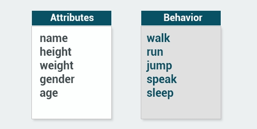
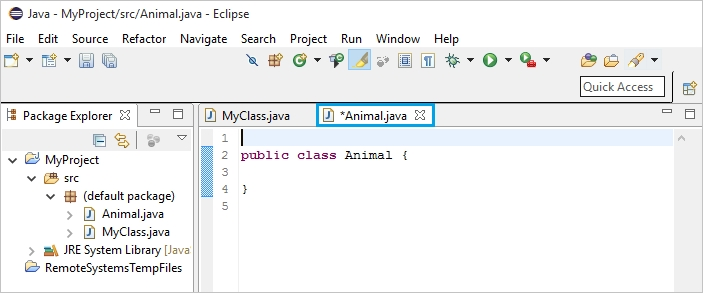
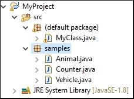
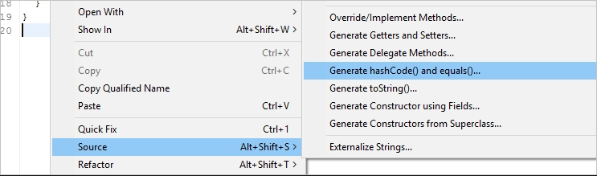

<p>
    GitHub: <a href="https://github.com/dark-teal-coder">@dark-teal-coder</a>
    <br />
    First Published Date: 2024-03-08
    <br />
    Last Modified Date: 2026-07-28
</p>

&nbsp;

---

&nbsp;

# Java Intermediate

Time to get serious and really see what Java (and you!) can do! In this course you’ll learn some concepts related to Object-Oriented Programming (OOP), Collections, and working with files. You’ll be a pro in no time!

&nbsp;

---

&nbsp;

## Table of Contents

- [Module 01: Classes and Objects](https://github.com/dark-teal-coder/course-sololearn-java-intermediate/blob/main/course-note-sololearn-java-intermediate.md#module-01-classes-and-objects)
  - [Lesson 01.01: Object-Oriented Programming]
  - [Lesson 01.02: Creating Classes & Objects]
  - [Lesson 01.03: Class Attributes]
  - [Lesson 01.04: Access Modifiers]
  - [Lesson 01.05: Getters and Setters]
  - [Lesson 01.06: Constructors]
  - [Lesson 01.07: Value & Reference Types]
  - [Lesson 01.08: The Math Class]
  - [Lesson 01.09: Static]
  - [Lesson 01.10: Final]
  - [Lesson 01.11: Packages]
  - [Quiz 01: Java 2 Module 1 Quiz]
- [Module 02: More on Classes](https://github.com/dark-teal-coder/course-sololearn-java-intermediate/blob/main/course-note-sololearn-java-intermediate.md#module-02-more-on-classes)
  - [Lesson 02.01: Encapsulation]
  - [Lesson 02.02: Inheritance]
  - [Lesson 02.03: Polymorphism]
  - [Lesson 02.04: Overriding & Overloading]
  - [Lesson 02.05: Abstract Classes]
  - [Lesson 02.06: Interfaces]
  - [Lesson 02.07: Casting]
  - [Lesson 02.08: Downcasting]
  - [Lesson 02.09: Anonymous Classes]
  - [Lesson 02.10: Inner Classes]
  - [Lesson 02.11: The equals() method]
  - [Lesson 02.12: Enums]
  - [Lesson 02.13: Using the Java API]
  - [Quiz 01: Java 2 Module 2 Quiz]
- [Module 03: Exceptions, Lists, Threads & Files](https://github.com/dark-teal-coder/course-sololearn-java-intermediate/blob/main/course-note-sololearn-java-intermediate.md#module-03-exceptions-lists-threads--files)
  - [Lesson 03.01: Exception Handling]
  - [Lesson 03.02: Multiple Exceptions]
  - [Lesson 03.03: Threads]
  - [Lesson 03.04: Runtime vs. Checked Exceptions]
  - [Lesson 03.05: ArrayList]
  - [Lesson 03.06: LinkedLists]
  - [Lesson 03.07: HashMap]
  - [Lesson 03.08: Sets]
  - [Lesson 03.09: Sorting Lists]
  - [Lesson 03.10: Iterators]
  - [Lesson 03.11: Working with Files]
  - [Lesson 03.12: Reading a File]
  - [Lesson 03.13: Creating & Writing Files]
  - [Quiz 01: Java 2 Module 3 Quiz]

&nbsp;

---

&nbsp;

## Module 01: Classes and Objects

### Lesson 01.01: Object-Oriented Programming

#### Object-Orientation

Java uses Object-Oriented Programming (OOP), a programming style that is intended to make thinking about programming closer to thinking about the real world.

In OOP, each object is an independent unit with a unique identity, just as objects in the real world are.

> :warning: An apple is an object; so is a mug. Each has its unique identity. It's possible to have two mugs that look identical, but they are still separate, unique objects.

Objects also have characteristics, which are used to describe them.

For example, a car can be red or blue, a mug can be full or empty, and so on. These characteristics are also called attributes. An attribute describes the current state of an object.

In the real world, each object behaves in its own way. The car moves, the phone rings, and so on.

The same applies to objects: behavior is specific to the object's type.

> :warning: In summary, in object oriented programming, each object has three dimensions: identity, attributes, and behavior. <br/> Attributes describe the object's current state, and what the object is capable of doing is demonstrated through the object's behavior.

#### Classes

A class describes what the object will be, but is separate from the object itself.

In other words, classes can be described as blueprints, descriptions, or definitions for an object. You can use the same class as a blueprint for creating multiple objects. The first step is to define the class, which then becomes a blueprint for object creation.

Each class has a name, and each is used to define attributes and behavior.

Some examples of attributes and behavior:

<p align="center">
    
</p>

> :warning: In other words, an object is an instance of a class.

#### Quiz 01.01.01

**Question**

A class defines _____ and _____.

Select all correct answers (choose 2).

- [ ] values
- [ ] apples
- [ ] behaviors
- [ ] attributes

**Answer**

- [ ] values
- [ ] apples
- [x] behaviors
- [x] attributes

### Lesson 01.02: Creating Classes & Objects

#### Creating Classes

In order to create your own custom objects, you must first create the corresponding classes. This is accomplished by right clicking on the `src` folder in Eclipse and selecting [Create] -> [New] -> [Class]. Give your class a name and click Finish to add the new class to your project:

<p align="center">
    
</p>

As you can see, Eclipse has already added the initial code for the class.

Now let's create a simple method in our new class.

Animal.java

```java
public class Animal {
	void bark() {
		System.out.println("Woof-Woof");
	}
}
```

We declared a bark() method in our Animal class.

> :warning: Now, in order to use the class and it's methods, we need to declare an object of that class.

#### Quiz 01.02.01

**Question**

Fill in the blanks to create a class with a single method called "test".

```java
public _____ A {
	public void _____() {
		System.out.println("Hi");
	}
}
```

**Answer**

`class` and `test`

```java
public class A {
	public void test() {
		System.out.println("Hi");
	}
}
```

#### Creating Objects

Let's head over to our main and create a new object of our class.

`MyClass.java`

```java
public class Animal {
	void bark() {
		System.out.println("Woof-Woof");
	}
}

class MyClass {
	public static void main(String[ ] args) {
		Animal dog = new Animal();
		dog.bark();
	}
}
```

Now, `dog` is an object of type `Animal`. Thus, we can call its `bark()` method, using the name of the object and a dot.

The dot notation is used to access the object's attributes and methods.

> :warning: You have just created your first object!

##### Creating Classes & Objects

###### Creating Classes & Objects

Create a program to show loading message to your application users.

Define a class Loading which has one public method called `loadingMessage()`, which should print "Loading" when called.

Create an object named loading and call that method.

> :warning: Don't forget to use new keyword while creating an object.

###### Solution

```java
public class Main {
	public static void main(String[] args) {
		Loading loading = new Loading();         
		loading.LoadingMessage();
	}
}

class Loading {
	public static void loadingMessage(){
		System.out.println("Loading");
	}
}
```

#### Quiz 01.02.02

**Question**

Fill in the blanks to create an object of the A class in the B class and call its "test" method.

```java
public _____ A {
	public void test() {
		System.out.println("Hi");
	}
}
class B {
	public static void main(String args[ ]) {
		_____ obj = _____ A();
		obj._____;
	}
}
```

**Answer**

`class`, `A`, `new` and `test()`

```java
public class A {
	public void test() {
		System.out.println("Hi");
	}
}
class B {
	public static void main(String args[ ]) {
		A obj = new A();
		obj.test();
	}
}
```

### Lesson 01.03: Class Attributes

#### Defining Attributes

A class has attributes and methods. The attributes are basically variables within a class.

Let's create a class called `Vehicle`, with its corresponding attributes and methods.

```java
public class Vehicle {
	int maxSpeed;
	int wheels;
	String color;
	double fuelCapacity;  
	
	void horn() {
		System.out.println("Beep!");
	}
}
```

`maxSpeed`, `wheels`, `color`, and `fuelCapacity` are the attributes of our `Vehicle` class, and `horn()` is the only method.

> :warning: You can define as many attributes and methods as necessary.

#### Quiz 01.03.01

**Question**

Drag and drop from the options below to define a class with these attributes: `age` of type integer, `height` as a double, and `name` as a string.

```java
_____ Person {
	_____ age;
	_____ height;
	_____ name;
}
```

- `String`
- `class`
- `void`
- `define`
- `attribute`
- `int`
- `double`

**Answer**

1. `class`
2. `int`
3. `double`
4. `String`

```java
class Person {
	int age;
	double height;
	String name;
}
```

#### Creating Objects

Next, we can create multiple objects of our Vehicle class, and use the dot syntax to access their attributes and methods.

```java
public class Vehicle {
	int maxSpeed;
	int wheels;
	String color;
	double fuelCapacity;  
	
	void horn() {
		System.out.println("Beep!");
	}
}

class MyClass {
	public static void main(String[ ] args) {
		Vehicle v1 = new Vehicle();
		Vehicle v2 = new Vehicle();
		v1.color = "red";
		v2.horn();
	}
}
```

> :warning: Run the code and see how it works!

##### Class Attributes

###### Class Attributes

You are the administrator of a hotel and must create customer information cards for your new customers. On the card, you must note the customer’s first and last name, age, and room number. 

The program you are given takes a guest's data (first name, last name, age, and room number) as input.

Complete the class by adding corresponding attributes so that the saveCustomerInfo() method works correctly. Also assign taken data values to attributes of created object.

Sample Input:
```
John
Smith
35
204
```

Sample Output:
```
First name: John
Second name: Smith
Age: 35
Room number: 204
```

> :warning: Be attentive to set correct data types for attributes.

###### Solution

```java
import java.util.Scanner;

public class Main {
	public static void main(String[] args) {
		// Take inputs
		Scanner read = new Scanner(System.in);
		String firstName = read.nextLine();
		String lastName = read.nextLine();
		int age = read.nextInt();
		int roomNumber = read.nextInt();
		// Assign data to attributes
		Customer customer = new Customer();
		customer.firstName = firstName; 
		customer.lastName = lastName; 
		customer.age = age; 
		customer.roomNumber = roomNumber;
		// Call method
		customer.saveCustomerInfo();
	}
}

class Customer {
	// Set attributes
	String firstName;
	String lastName;
	int age;
	int roomNumber;
	// Define method
	public void saveCustomerInfo() {
		System.out.println("First name: " + firstName);
		System.out.println("Last name: " + lastName);
		System.out.println("Age: " + age);
		System.out.println("Room number: " + roomNumber);
	}
}
```

#### Quiz 01.03.02

**Question**

Fill in the blanks to create two objects from the class "People".

```java
People obj1 = _____ People();
People obj2 = new People _____;
```

**Answer**

`new` and `()`

```java
People obj1 = new People();
People obj2 = new People ();
```

### Lesson 01.04: Access Modifiers

#### Access Modifiers

Now let's discuss the public keyword in front of the main method.

```java
public static void main(String[ ] args)
```

`public` is an access modifier, meaning that it is used to set the level of access. You can use access modifiers for classes, attributes, and methods.

For classes, the available modifiers are public or default (left blank), as described below:
- `public`: The class is accessible by any other class.
- `default`: The class is accessible only by classes in the same package.

The following choices are available for attributes and methods:
- `default`: A variable or method declared with no access control modifier is available to any other class in the same package.
- `public`: Accessible from any other class.
- `protected`: Provides the same access as the default access modifier, with the addition that subclasses can access protected methods and variables of the superclass (Subclasses and superclasses are covered in upcoming lessons).
- `private`: Accessible only within the declared class itself.

Example:

```java
public class Vehicle {
	private int maxSpeed;
	private int wheels;
	private String color;
	private double fuelCapacity;
	
	public void horn() {
		System.out.println("Beep!");
	}
}
```

> :warning: It's a best practice to keep the variables within a class private. The variables are accessible and modified using Getters and Setters.

##### Access Modifiers

###### Access Modifiers

You're a tour manager and you need to have a list of countries along with its capitals. You're given a program which creates Country object and you should output the name and the capital, but something goes wrong. Change the access modifiers of the Country class fields in order to perform the required output.

> :warning: Use public access modifier to provide access to any other classes.

###### Solution

```java
public class Program{
	public static void main(String[] args) {
		Country c = new Country();
		c.name = "France";
		c.capital = "Paris";
		System.out.println("Country:  " + c.name);
		System.out.println("Capital:  " + c.capital);
	}	
}
class Country{
	// Change "private" to "public"
	public String name;
	protected String capital;
}
```

#### Quiz 01.04.01

**Question**

Which of the following are valid access modifiers? 

Select all correct answers.

- [ ] `public`
- [ ] `protected`
- [ ] `private`
- [ ] `hidden`

**Answer**

- [x] `public`
- [x] `protected`
- [x] `private`
- [ ] `hidden`

### Lesson 01.05: Getters and Setters

#### Getters & Setters

Getters and Setters are used to effectively protect your data, particularly when creating classes. For each variable, the get method returns its value, while the set method sets the value.

- Getters start with get, followed by the variable name, with the first letter of the variable name capitalized.
- Setters start with set, followed by the variable name, with the first letter of the variable name capitalized.

Example:

```java
public class Vehicle {
	private String color;
	
	// Getter
	public String getColor() {
		return color;
	}
	
	// Setter
	public void setColor(String c) {
		this.color = c;
	}
}
```

The getter method returns the value of the attribute.

The setter method takes a parameter and assigns it to the attribute.

> :warning: The keyword this is used to refer to the current object. Basically, this.color is the color attribute of the current object.

#### Quiz 01.05.01

**Question**

Drag and drop from the options below to define the set and get methods.

```java
class A {
	private int x;
	public _____ getX() {
		return _____;
	}
	public _____ setX(int x) {
		this.x = x;
	}
}
```

**Answer**

`int`, `x` and `void`

```java
class A {
	private int x;
	public int getX() {
		return x;
	}
	public void setX(int x) {
		this.x = x;
	}
}
```

#### Getters & Setters

Once our getter and setter have been defined, we can use it in our main:

```java
public class Vehicle {
	private String color;
	
	// Getter
	public String getColor() {
		return color;
	}
	
	// Setter
	public void setColor(String c) {
		this.color = c;
	}
}

class Program {
	public static void main(String[ ] args) {
		Vehicle v1 = new Vehicle();
		v1.setColor("Red");
		System.out.println(v1.getColor());
	}
}
```

Getters and setters allow us to have control over the values. You may, for example, validate the given value in the setter before actually setting the value.

> :warning: Getters and setters are fundamental building blocks for encapsulation, which will be covered in the next module.

##### Getters and Setters

###### Getters and Setters

The program you are given receives name and age of student as input.

Complete the program to set the values for the corresponding attributes of the Student class and prints out the final result. If the age is <0, program should output "Invalid age" and assign a 0 value to the age attribute.

Sample input:
```
Olivia
-2
```

Sample output:
```
Invalid age
Name: Olivia
Age: 0
```

Explanation
-2 is invalid value for age attribute, that's why "Invalid age" and "Age: 0" is printed. Setter and Getter should handle this.

> :warning: You need to handle the conditions inside the Getter and the Setter.

###### Solution

```java
import java.util.Scanner;

class Main {
	public static void main(String[] args) {
		Scanner input = new Scanner(System.in);
		String name = input.nextLine();
		int age = input.nextInt();
		Student student = new Student();
		
		student.name = name;
		// Set age via Setter
		if (age < 0){
			System.out.println("Invalid age"); 
			student.setAge(0);    
		}
		else {
			student.setAge(age);
		}
		
		System.out.println("Name: " + student.name);
		System.out.println("Age: " + student.getAge());
	}
}

class Student {
	public String name;
	private int age;
	
	public int getAge() {
		// Complete Getter
		return age; 
	}
	public void setAge(int age) {
		// Complete Setter
		this.age = age; 
	}
}
```

#### Quiz 01.05.02

**Question**

What would the name of the setter method for the class variable named "age" be?

- [ ] `intAge`
- [ ] `setAge`
- [ ] `Age`
- [ ] `getAge`

**Answer**

- [ ] `intAge`
- [x] `setAge`
- [ ] `Age`
- [ ] `getAge`

### Lesson 01.06: Constructors

#### Constructors

Constructors are special methods invoked when an object is created and are used to initialize them. 

A constructor can be used to provide initial values for object attributes.

- A constructor name must be same as its class name.
- A constructor must have no explicit return type.

Example of a constructor:

```java
public class Vehicle {
	private String color;
		Vehicle() {
		color = "Red";
	}
}
```

The Vehicle() method is the constructor of our class, so whenever an object of that class is created, the color attribute will be set to "Red".

A constructor can also take parameters to initialize attributes.

```java
public class Vehicle {
	private String color;
		Vehicle(String c) {
		color = c;
	}
}
```

> :warning: You can think of constructors as methods that will set up your class by default, so you don’t need to repeat the same code every time.

#### Quiz 01.06.01

**Question**

Drag and drop from the options below to create a valid constructor.

```java
class Person {
	private int age;
	public _____ (_____ myage) {
		age = myage;
	}
}
```

- [ ] `constructor`
- [ ] `private`
- [ ] `Person`
- [ ] `int`

**Answer**

```java
class Person {
	private int age;
	public Person (int myage) {
		age = myage;
	}
}
```

#### Using Constructors

The constructor is called when you create an object using the new keyword.

Example:

```java
public class MyClass {
	public static void main(String[ ] args) {
		Vehicle v = new Vehicle("Blue");
	}
}
```

> :warning: This will call the constructor, which will set the color attribute to "Blue".

#### Quiz 01.06.02

**Question**

True or false: The constructor must have the same name as the class.

- [ ] False
- [ ] True

**Answer**

- [ ] False
- [x] True

#### Constructors

A single class can have multiple constructors with different numbers of parameters.

The setter methods inside the constructors can be used to set the attribute values.

Example:

```java
public class Vehicle {
	private String color;
	
	Vehicle() {
		this.setColor("Red");
	}
	Vehicle(String c) {
		this.setColor(c);
	}
	
	// Setter
	public void setColor(String c) {
		this.color = c;
	}
}
```

The class above has two constructors, one without any parameters setting the color attribute to a default value of "Red", and another constructor that accepts a parameter and assigns it to the attribute.

Now, we can use the constructors to create objects of our class.

```java
public class Vehicle {
	private String color;
	
	Vehicle() {
		this.setColor("Red");
	}
	Vehicle(String c) {
		this.setColor(c);
	}
	
	// Setter
	public void setColor(String c) {
		this.color = c;
	}
	
	// Getter
	public String getColor() {
		return color;
	}
}

public class Program {
	public static void main(String[] args) {        
		//color will be "Red"
		Vehicle v1 = new Vehicle();
		
		//color will be "Green"
		Vehicle v2 = new Vehicle("Green"); 
		
		System.out.println(v2.getColor());
	}
}
```

> :warning: Java automatically provides a default constructor, so all classes have a constructor, whether one is specifically defined or not.

##### Constructors

###### Constructors

Your friend is a cashier at a movie theater. He knows that you are an awesome java developer so he asked you to help him out and create a program that gets movie title, row, and seat information and prints out a new ticket.

Complete the existing code by adding a constructor to Ticket class so that it can be correctly initialized.

Sample Input
```
Jaws
5
1
```

Sample Output
```
Movie: Jaws
Row: 5
Seat: 1
```

> :warning: You can figure out the constructor parameters by looking at the types of data that is being inputted.

###### Solution

```java
import java.util.Scanner;

class Main {
	public static void main(String[] args) {
		Scanner input = new Scanner(System.in);
		String movie = input.nextLine();
		int row = input.nextInt();
		int seat = input.nextInt();
		Ticket ticket = new Ticket(movie, row, seat);
		System.out.println("Movie: " + ticket.getMovie());
		System.out.println("Row: " + ticket.getRow());
		System.out.println("Seat: " + ticket.getSeat());
	}
}

class Ticket {
	private String movie;
	private int row;
	private int seat;
	
	//complete the constructor
	public Ticket(String movie, int row, int seat) {
		this.movie = movie; 
		this.row = row; 
		this.seat = seat;
	}
	
	public String getMovie() {
		return movie;
	}
	
	public int getRow() {
		return row;
	}
	
	public int getSeat() {
		return seat;
	}
}
```

#### Quiz 01.06.03

**Question**

Fill in the blanks.

```java
_____ A
{
	private int x;
	public A(_____ val) {
		x = val;
	}
}
```

**Answer**

```java
class A
{
	private int x;
	public A(int val) {
		x = val;
	}
}
```

### Lesson 01.07: Value & Reference Types

#### Value Types

Value types are the basic types, and include byte, short, int, long, float, double, boolean, and char.

These data types store the values assigned to them in the corresponding memory locations.

So, when you pass them to a method, you basically operate on the variable's value, rather than on the variable itself.

Example:

```java
public class MyClass {
	public static void main(String[ ] args) {
		int x = 5;
		addOneTo(x);
		System.out.println(x);       
	}
	
	static void addOneTo(int num) {
		num = num + 1;
	}
}
```

> :warning: The method from the example above takes the value of its parameter, which is why the original variable is not affected and 5 remains as its value.

#### Quiz 01.07.01

**Question**

What is the output of this code?

```java
public static void main(String[ ] args) {
	int x = 4;
	square(x);
	System.out.println(x); 
}
static void square(int x) {
	x = x*x;
}
```

**Answer**

`4`

#### Reference Types

A reference type stores a reference (or address) to the memory location where the corresponding data is stored.

When you create an object using the constructor, you create a reference variable.

For example, consider having a Person class defined:

```java
public class MyClass {
	public static void main(String[ ] args) {
		Person j;
		j = new Person("John");
		j.setAge(20);
		celebrateBirthday(j);
		System.out.println(j.getAge());
	}
	static void celebrateBirthday(Person p) {
		p.setAge(p.getAge() + 1);
	}
}

public class Person {
	private String name;
	private int age;
	
	Person (String n) {
		this.name = n;
	}
	
	public int getAge() {
		return age;
	}
	
	public void setAge(int a) {
		this.age = a;
	}
}
```

The method celebrateBirthday takes a Person object as its parameter, and increments its attribute.

Because `j` is a reference type, the method affects the object itself, and is able to change the actual value of its attribute.

> :warning: Arrays and Strings are also reference data types.

#### Quiz 01.07.02

**Question**

What is the output of this code?

```java
public static void main(String[ ] args) {
	Person p = new Person();
	p.setAge(25);
	change(p);
	System.out.println(p.getAge());
}
static void change(Person p) {
	p.setAge(10);
}
```

**Answer**

`10`

### Lesson 01.08: The Math Class

#### The Math Class

The JDK defines a number of useful classes, one of them being the Math class, which provides predefined methods for mathematical operations.

You do not need to create an object of the Math class to use it. To access it, just type in Math. and the corresponding method.

`Math.abs()` returns the absolute value of its parameter.

```java
public class Program {
	public static void main(String[] args) {
		int a = Math.abs(10); 
		System.out.println(a);
		
		int b = Math.abs(-20);
		System.out.println(b);
	}
}
```

`Math.ceil()` rounds a floating point value up to the nearest integer value. The rounded value is returned as a double.

```java
public class Program {
	public static void main(String[] args) {
		double c = Math.ceil(7.342);
		System.out.println(c);  
	}
}
```

Similarly, `Math.floor()` rounds a floating point value down to the nearest integer value.

```java
public class Program {
	public static void main(String[] args) {
		double f = Math.floor(7.343);
		System.out.println(f);
	}
}
```

`Math.max()` returns the largest of its parameters.

```java
public class Program {
	public static void main(String[] args) {
		int m = Math.max(10, 20); 
		System.out.println(m);
	}
}
```

Conversely, `Math.min()` returns the smallest parameter.

```java
public class Program {
	public static void main(String[] args) {
		int m = Math.min(10, 20); 
		System.out.println(m); 
	}
}
```

`Math.pow()` takes two parameters and returns the first parameter raised to the power of the second parameter.

```java
public class Program {
	public static void main(String[] args) {
		double p = Math.pow(2, 3);
		System.out.println(p);  
	}
}
```

> :warning: There are a number of other methods available in the Math class, including: <br> sqrt() for square root, sin() for sine, cos() for cosine, and others.

##### The Math Class

###### The Math Class

Write a program to take numbers as input and return the first number raised to the power of the second number.

Sample Input: 
```
2
4
```

Sample Output: 
```
16.0
```

> :warning: Use Math.pow() method.

###### Solution

```java
import java.util.Scanner;

class Main {
	public static void main(String[] args) {
		Scanner input = new Scanner(System.in);
		int num1 = input.nextInt();
		int num2 = input.nextInt();
		double result = Math.pow(num1, num2); 
		System.out.println(result);
	}
}
```

#### Quiz 01.08.01

**Question**

What is the value of the following expression?

```java
Math.abs(Math.min(-6, 3));
```

**Answer** 

- [ ] `-6`
- [ ] `6`
- [ ] `3`

### Lesson 01.09: Static

#### Static

When you declare a variable or a method as static, it belongs to the class, rather than to a specific instance. This means that only one instance of a static member exists, even if you create multiple objects of the class, or if you don't create any. It will be shared by all objects.

Example:

```java
public class Counter {
	public static int COUNT=0;
		Counter() {
		COUNT++;
	}
}
```

The COUNT variable will be shared by all objects of that class.

Now, we can create objects of our Counter class in main, and access the static variable.

```java
public class Counter {
	public static int COUNT=0;
	Counter() {
		COUNT++;
	}
}
public class MyClass {
	public static void main(String[ ] args) {
		Counter c1 = new Counter();
		Counter c2 = new Counter();
		System.out.println(Counter.COUNT);
	}
}
```

The output is 2, because the COUNT variable is static and gets incremented by one each time a new object of the Counter class is created. In the code above, we created 2 objects.

You can also access the static variable using any object of that class, such as c1.COUNT.

> :warning: It’s a common practice to use upper case when naming a static variable, although not mandatory.

#### Quiz 01.09.01

**Question**

Fill in the blank to declare a static variable.

```java
public _____ int x = 0;
```

**Answer**

`static`

```java
public static int x = 0;
```

#### Static

The same concept applies to static methods.

```java
public class Vehicle {
	public static void horn() {
		System.out.println("Beep");
	}
}
```

Now, the horn method can be called without creating an object:

```java
public class Vehicle {
	public static void horn() {
		System.out.println("Beep");
	}
}
public class MyClass {
	public static void main(String[ ] args) {
		Vehicle.horn();
	}
}
```

Another example of static methods are those of the Math class, which is why you can call them without creating a Math object.

> :warning: Also, the main method must always be static.

#### Quiz 01.09.02

**Question**

What output results from this code?

```java
class Person {
	public static int pCount; 
	public static void main(String[ ] args) { 
		Person.pCount = 1; 
		Person.pCount++;
		System.out.println(Person.pCount); 
	}
}
```

**Answers**

`2`

### Lesson 01.10: Final

#### final

Use the final keyword to mark a variable constant, so that it can be assigned only once.

Example:

```java
class MyClass {
	public static final double PI = 3.14; 
	public static void main(String[ ] args) {
		System.out.println(PI);
	}
}
```

PI is now a constant. Any attempt to assign it a value will cause an error.

> :warning: Methods and classes can also be marked final. This serves to restrict methods so that they can't be overridden and classes so that they can't be subclassed.<br>These concepts will be covered in the next module.

#### Quiz 01.10.01

**Question**

What keyword makes a variable a constant?

**Answer**

`final`

### Lesson 01.11: Packages

#### Packages

Packages are used to avoid name conflicts and to control access to classes.

A package can be defined as a group made up of similar types of classes, along with sub-packages.

Creating a package in Java is quite easy. Simply right click on your src directory and click New->Package. Give your package a name and click Finish.

You will notice that the new package appears in the project directory. Now you can move and create classes inside that package. We have moved our Vehicle, Counter and Animal classes to the package samples.

<p align="center">
    
</p>

When you move/create a class in your package, the following code will appear at the top of the list of files.

```java
package samples;
```

This indicates the package to which the class belongs.

Now, we need to import the classes that are inside a package in our main to be able to use them.

The following example shows how to use the Vehicle class of the samples package.

```java
import samples.Vehicle;

class MyClass {
	public static void main(String[ ] args) {
		Vehicle v1 = new Vehicle();
		v1.horn();
	}
}
```

Two major results occur when a class is placed in a package. First, the name of the package becomes a part of the name of the class. Second, the name of the package must match the directory structure where the corresponding class file resides.

> :warning: Use a wildcard to import all classes in a package. For example, import samples.* will import all classes in the samples package.

#### Quiz 01.11.01

**Question**

How many packages can be contained in a Java program?

- [ ] none
- [ ] as many as you need
- [ ] one

**Answer**

- [ ] none
- [x] as many as you need
- [ ] one

### Quiz 01: Module 1 Quiz


&nbsp;

---

&nbsp;

## Module 02: More on Classes

### Lesson 02.01: Encapsulation

#### Encapsulation

There are 4 core concepts in OOP: encapsulation, inheritance, polymorphism, and abstraction.

The idea behind encapsulation is to ensure that implementation details are not visible to users. The variables of one class will be hidden from the other classes, accessible only through the methods of the current class. This is called data hiding.

To achieve encapsulation in Java, declare the class' variables as private and provide public setter and getter methods to modify and view the variables' values.

Example: 

```java
class BankAccount {
	private double balance=0;
	public void deposit(double x) {
		if(x > 0) {
			balance += x;
		}
	}
}
```

This implementation hides the balance variable, enabling access to it only through the deposit method, which validates the amount to be deposited before modifying the variable.

> :warning: In summary, encapsulation provides the following benefits:<br>- Control of the way data is accessed or modified<br>- More flexible and easily changed code<br>- Ability to change one part of the code without affecting other parts

#### Quiz 02.01.01

**Question**

Drag and drop from the options below to create a valid Java code with encapsulation.

```java
public class Person {
	_____ int age;
	_____ void setAge(_____ age) {
		if (age > 0) {
			this.age = age;
		}
	}
}
```

- `public`
- `int`
- `final`
- `String`
- `static`
- `private`

**Answers**

1. `private`
2. `public`
3. `int`

```java
public class Person {
	private int age;
	public void setAge(int age) {
		if (age > 0) {
			this.age = age;
		}
	}
}
```

### Lesson 02.02: Inheritance

#### Inheritance

Inheritance is the process that enables one class to acquire the properties (methods and variables) of another. With inheritance, the information is placed in a more manageable, hierarchical order.

The class inheriting the properties of another is the subclass (also called derived class, or child class); the class whose properties are inherited is the superclass (base class, or parent class).

To inherit from a class, use the extends keyword.

This example shows how to have the class Dog to inherit from the class Animal.

Example: 

```java
class Dog extends Animal {
	// some code
}
```

> :warning: Here, Dog is the subclass, and Animal is the superclass.

#### Quiz 02.02.01

**Question**

Fill in the blank to inherit the Car class from the Vehicle class.

```java
class Car _____ Vehicle{}
```

**Answers**

```java
class Car extends Vehicle{}
```

#### Inheritance

When one class is inherited from another class, it inherits all of the superclass' non-private variables and methods.

Example:

```java
class Animal {
	protected int legs;
	public void eat() {
		System.out.println("Animal eats");
	}
}

class Dog [b]extends [/b]Animal {
	Dog() {
		legs = 4;
	}
}
```

As you can see, the Dog class inherits the legs variable from the Animal class.

We can now declare a Dog object and call the eat method of its superclass:

```java
class Animal {
    protected int legs;
    public void eat() {
        System.out.println("Animal eats");
    }
}

class Dog extends Animal {
    Dog() {
        legs = 4;
    }
}

class MyClass {
    public static void main(String[ ] args) {
        Dog d = new Dog();
        d.eat();
    }
}
```

> :warning: Recall the protected access modifier, which makes the members visible only to the subclasses.

#### Quiz 02.02.02

**Question**

Fill in the blanks to inherit from the Animal class and call its method in main.

**Answer**

```java
class Animal {
	public void makeSound() {
		System.out.println(''Hi'');
	}
}
_____ Dog _____ Animal {
}
class A {
	public static void main(String args[ ]) {
		Dog dog = new Dog();
		_____.makeSound();
	}
}
```

#### Inheritance

Constructors are not member methods, and so are not inherited by subclasses.

However, the constructor of the superclass is called when the subclass is instantiated.

Example:

```java
class A {
	public A() {
		System.out.println("New A");
	}
}

class B extends A {
	public B() {
		System.out.println("New B");
	}
}

class Program {
	public static void main(String[ ] args) {
		B obj = new B();
	}
}
```

> :warning: You can access the superclass from the subclass using the super keyword. For example, super.var accesses the var member of the superclass.

#### Quiz 02.02.03

**Question**

True or false: Private methods are inherited from the super class.

- [ ] False
- [ ] True

**Answer**

- [x] False
- [ ] True

### Lesson 02.03: Polymorphism

#### Polymorphism

Polymorphism, which refers to the idea of "having many forms", occurs when there is a hierarchy of classes related to each other through inheritance.

A call to a member method will cause a different implementation to be executed, depending on the type of the object invoking the method.

Here is an example: Dog and Cat are classes that inherit from the Animal class. Each class has its own implementation of the makeSound() method.

```java
class Animal {
	public void makeSound() {
		System.out.println("Grr...");
	}
}
class Cat extends Animal {
	public void makeSound() {
		System.out.println("Meow");
	}
}
class Dog extends Animal {
	public void makeSound() {
		System.out.println("Woof");
	}
}
```

As all Cat and Dog objects are Animal objects, we can do the following in main:

```java
public static void main(String[ ] args) {
	Animal a = new Dog();
	Animal b = new Cat();
}
```

We've created two reference variables of type Animal, and pointed them to the Cat and Dog objects.

Now, we can call the makeSound() methods.

```java
class Animal {
	public void makeSound() {
		System.out.println("Grr...");
	}
}
class Cat extends Animal {
	public void makeSound() {
		System.out.println("Meow");
	}
}
class Dog extends Animal {
	public void makeSound() {
		System.out.println("Woof");
	}
}

class Program {
	public static void main(String args[ ]) {
		Animal a = new Dog();
		Animal b = new Cat();
		
		a.makeSound();
		b.makeSound();
	}
}
```

As the reference variable a contains a Dog object, the makeSound() method of the Dog class will be called.

The same applies to the b variable.

> :warning: This demonstrates that you can use the Animal variable without actually knowing that it contains an object of the subclass. This is very useful when you have multiple subclasses of the superclass.

#### Quiz 02.03.01

**Question**

Briefly, polymorphism is _____

- [ ] ...each implementation, with a different method
- [ ] ...one method, with different implementations
- [ ] ...one implementation, with different methods

**Answer**

- [ ] ...each implementation, with a different method
- [x] ...one method, with different implementations
- [ ] ...one implementation, with different methods

### Lesson 02.04: Overriding & Overloading

#### Method Overriding

As we saw in the previous lesson, a subclass can define a behavior that's specific to the subclass type, meaning that a subclass can implement a parent class method based on its requirement.

This feature is known as method overriding.

Example:

```java
class Animal {
	public void makeSound() {
		System.out.println("Grr...");
	}
}

class Cat extends Animal {
	public void makeSound() {
		System.out.println("Meow");
	}
}

class Program {
	public static void main(String[] args) {
		Cat c = new Cat();
		c.makeSound();
	}
}
```

In the code above, the Cat class overrides the makeSound() method of its superclass Animal.

Rules for Method Overriding:
- Should have the same return type and arguments
- The access level cannot be more restrictive than the overridden method's access level (Example: If the superclass method is declared public, the overriding method in the sub class can be neither private nor protected)
- A method declared final or static cannot be overridden
- If a method cannot be inherited, it cannot be overridden
- Constructors cannot be overridden

> :warning: Method overriding is also known as runtime polymorphism.

#### Quiz 02.04.01

**Question**

True or false: Overridden methods should have the same return type and arguments as the parent method.

- [ ] False
- [ ] True

**Answer**

- [ ] False
- [x] True

#### Method Overloading

When methods have the same name, but different parameters, it is known as method overloading.

This can be very useful when you need the same method functionality for different types of parameters.

The following example illustrates a method that returns the maximum of its two parameters.

```java
int max(int a, int b) {
	if(a > b) {
		return a;
	}
	else {
		return b;
	}
}
```

The method shown above will only work for parameters of type integer.

However, we might want to use it for doubles, as well. For that, you need to overload the max method:

```java
class Program {
	static double max(double a, double b) {
		if(a > b) {
			return a;
		}
		else {
			return b;
		}
	}
	static int max(int a, int b) {
		if(a > b) {
			return a;
		}
		else {
			return b;
		}
	}
	public static void main(String[] args) {        
		System.out.println(max(8, 17));
		System.out.println(max(3.14, 7.68));
	}
}
```

Now, our max method will also work with doubles.

An overloaded method must have a different argument list; the parameters should differ in their type, number, or both.

> :warning: Another name for method overloading is compile-time polymorphism.

#### Quiz 02.04.02

**Question**

What is the output of this code?

```java
class A {
	public void doSomething() {
		System.out.println("A");
	}
	public void doSomething(String str) {
		System.out.println(str);
	}
}
class B {
	public static void main(String[ ] args) {
		A object = new A();
		object.doSomething("B");
	}
}
```

- [ ] AB
- [ ] Nothing
- [ ] B
- [ ] A

**Answer**

- [ ] AB
- [ ] Nothing
- [x] B
- [ ] A

### Lesson 02.05: Abstract Classes

#### Abstraction

Data abstraction provides the outside world with only essential information, in a process of representing essential features without including implementation details.

A good real-world example is a book. When you hear the term book, you don't know the exact specifics, such as the page count, the color, or the size, but you understand the idea, or abstraction, of a book.

The concept of abstraction is that we focus on essential qualities, rather than the specific characteristics of one particular example.

In Java, abstraction is achieved using abstract classes and interfaces.

An abstract class is defined using the abstract keyword.

- If a class is declared abstract it cannot be instantiated (you cannot create objects of that type).
- To use an abstract class, you have to inherit it from another class.
- Any class that contains an abstract method should be defined as abstract.

> :warning: An abstract method is a method that is declared without an implementation (without braces, and followed by a semicolon): abstract void walk();

#### Quiz 02.05.01

**Question**

True or false: A class containing an abstract method is an abstract class.

- [ ] False
- [ ] True

**Answer**

- [ ] False
- [x] True

#### Abstract Class

For example, we can define our Animal class as abstract:

```java
abstract class Animal {
	int legs = 0;
	abstract void makeSound();
}
```

The makeSound() method is also abstract, as it has no implementation in the superclass.

We can inherit from the Animal class and define the makeSound() method for the subclass:

```java
abstract class Animal {
	int legs = 0;
	abstract void makeSound();
}
class Cat extends Animal {
	public void makeSound() {
		System.out.println("Meow");
	}
}
public class Program {
	public static void main(String[] args) {
		Cat c = new Cat();
		c.makeSound();
	}
}
```

> :warning: Every Animal makes a sound, but each has a different way to do it. That's why we define an abstract class Animal, and leave the implementation of how they make sounds to the subclasses. This is used when there is no meaningful definition for the method in the superclass.

#### Quiz 02.05.02

**Question**

Fill in the blanks to create an abstract class with an abstract method and inherit from it.

```java
abstract class Animal {
	public int age;
	public _____ int printAge();
}
class Dog _____ Animal {
	public _____ printAge() {
		return age;
	}
}
```

**Answer**

```java
abstract class Animal {
	public int age;
	public abstract int printAge();
}
class Dog extends Animal {
	public int printAge() {
		return age;
	}
}
```

### Lesson 02.06: Interfaces

#### Interfaces

An interface is a completely abstract class that contains only abstract methods.

Some specifications for interfaces:

- Defined using the interface keyword.
- May contain only static final variables.
- Cannot contain a constructor because interfaces cannot be instantiated.
- Interfaces can extend other interfaces.
- A class can implement any number of interfaces.

An example of a simple interface:

```java
interface Animal {
	public void eat();
	public void makeSound();
}
```

Interfaces have the following properties:

- An interface is implicitly abstract. You do not need to use the abstract keyword while declaring an interface.
- Each method in an interface is also implicitly abstract, so the abstract keyword is not needed.
- Methods in an interface are implicitly public.

> :warning: A class can inherit from just one superclass, but can implement multiple interfaces!

#### Quiz 02.06.01

**Question**

In Java, how many superclasses can your inherited subclass have?

- [ ] none
- [ ] only one
- [ ] only two
- [ ] multiple

**Answer**

- [ ] none
- [x] only one
- [ ] only two
- [ ] multiple

#### Interfaces

Use the implements keyword to use an interface with your class.

```java
interface Animal {
	public void eat();
	public void makeSound();
}
class Cat implements Animal {
	public void makeSound() {
		System.out.println("Meow");
	}
	public void eat() {
		System.out.println("omnomnom");
	}
}
public class Program {
	public static void main(String[] args) {
		Cat c = new Cat();
		c.eat();
	}
}
```

> :warning: When you implement an interface, you need to override all of its methods.

#### Quiz 02.06.02

**Question**

Drag and drop from the options below to implement an interface.

```java
interface Animal {
	public void eat();
}
_____ Cat implements _____ {
	public _____ eat() {
		System.out.println("Cat eats");
	}
}
```

- [ ] `void`
- [ ] `return`
- [ ] `class`
- [ ] `Abstract`
- [ ] `Animal`
- [ ] `Cat`

**Answer**

```java
interface Animal {
	public void eat();
}
class Cat implements Animal {
	public void eat() {
		System.out.println("Cat eats");
	}
}
```

1. `class`
2. `Animal`
3. `void`

### Lesson 02.07: Casting

#### Type Casting

Assigning a value of one type to a variable of another type is known as Type Casting.

To cast a value to a specific type, place the type in parentheses and position it in front of the value.

Example:

```java
public class Program {
	public static void main(String[] args) {
		double a = 42.571;
		int b = (int) a;
		System.out.println(b);
	}
}
```

The code above is casting the value 3.14 to an integer, with 3 as the resulting value.

Another example:

```java
public class Program {
	public static void main(String[] args) {
		double a = 42.571;
		int b = (int) a;
		System.out.println(b);
	}
}
```

> :warning: Java supports automatic type casting of integers to floating points, since there is no loss of precision. On the other hand, type casting is mandatory when assigning floating point values to integer variables.

#### Quiz 02.07.01

**Question**

What is the output of this code?

```java
public static void main(String[ ] args) { 
	double x = 1.5;
	double y = 2.65;
	sum((int)x, (int)y);
}
static void sum(int x, int y) {
	System.out.println(x + y);
}
```

**Answer**

`3`

### Lesson 02.08: Downcasting

#### Type Casting

For classes, there are two types of casting.

##### Upcasting

You can cast an instance of a subclass to its superclass.

Consider the following example, assuming that Cat is a subclass of Animal. 

```java
Animal a = new Cat();
```

Java automatically upcasted the Cat type variable to the Animal type.

##### Downcasting

Casting an object of a superclass to its subclass is called downcasting.

Example:

```java
Animal a = new Cat();
((Cat)a).makeSound();
```

This will try to cast the variable a to the Cat type and call its makeSound() method.

> :warning: Why is upcasting automatic, downcasting manual? Well, upcasting can never fail. But if you have a group of different Animals and want to downcast them all to a Cat, then there's a chance that some of these Animals are actually Dogs, so the process fails.

#### Quiz 02.08.01

**Question**

What is the output of this code?

```java
class A {
	public void print() {
		System.out.println("A");
	}
}
class B extends A {
	public void print() {
		System.out.println("B");
	}
	public static void main(String[ ] args) {
		A object = new B();
		B b = (B) object;
		b.print();
	}
}
```

- [ ] A
- [ ] nothing
- [ ] B

**Answer**

- [ ] A
- [ ] nothing
- [x] B

### Lesson 02.09: Anonymous Classes

#### Anonymous Classes

Anonymous classes are a way to extend the existing classes on the fly.

For example, consider having a class Machine:

```java
class Machine {
	public void start() {
		System.out.println("Starting...");
	}
}
```

When creating the Machine object, we can change the start method on the fly.

```java
class Machine {
	public void start() {
		System.out.println("Starting...");
	}
}
class Program {
	public static void main(String[ ] args) {
		Machine m = new Machine() {
			@Override public void start() {
				System.out.println("Wooooo");
			}
		};
		m.start();
	}
}
```

After the constructor call, we have opened the curly braces and have overridden the start method's implementation on the fly.

> :warning: The @Override annotation is used to make your code easier to understand, because it makes it more obvious when methods are overridden.

#### Quiz 02.09.01

**Question**

Fill in the blanks to override the start method of the Machine class.

```java
Machine m = _____ Machine() {
_____Override public void _____() {
		System.out.println("Hi");
	}
}
```

**Answer**

```java
Machine m = new Machine() {
@Override public void start() {
		System.out.println("Hi");
	}
}
```

#### Anonymous Classes

The modification is applicable only to the current object, and not the class itself. So if we create another object of that class, the start method's implementation will be the one defined in the class.

```java
class Machine {
	public void start() {
		System.out.println("Starting...");
	}
}
class Program {
	public static void main(String[ ] args) {
		Machine m1 = new Machine() {
			@Override public void start() {
				System.out.println("Wooooo");
			}
		};
		Machine m2 = new Machine();
		m2.start();
		}
}
```

#### Quiz 02.09.02

**Question**

Drag and drop from the options below to print "Hello".

```java
class A {
	public void print() {
		System.out.println("A");
	}
}
class B {
	public static void main(String[ ] args) {
		_____ object = _____ A() {
			@Override public void _____() {
				System.out.println(_____);
			}
		};
		object.print();
	}
}
```

- [ ] `new`
- [ ] `print`
- [ ] `"Hello"`
- [ ] `String`
- [ ] `A`
- [ ] `B`
- [ ] `extends`

**Answer**

```java
class A {
	public void print() {
		System.out.println("A");
	}
}
class B {
	public static void main(String[ ] args) {
		A object = new A() {
			@Override public void print() {
				System.out.println("Hello");
			}
		};
		object.print();
	}
}
```

1. `A`
2. `new`
3. `print`
4. `"Hello"`

### Lesson 02.10: Inner Classes

#### Inner Classes

Java supports nesting classes; a class can be a member of another class.

Creating an inner class is quite simple. Just write a class within a class. Unlike a class, an inner class can be private. Once you declare an inner class private, it cannot be accessed from an object outside the class.

Example:

```java
class Robot {
	int id;
	Robot(int i) {
		id = i;
		Brain b = new Brain();
		b.think();
	}
	private class Brain {
		public void think() {
			System.out.println(id + " is thinking");
		}
	}
}
public class Program {
	public static void main(String[] args) {
		Robot r = new Robot(1);
	}
}
```

> :warning: The class Robot has an inner class Brain. The inner class can access all of the member variables and methods of its outer class, but it cannot be accessed from any outside class.

#### Quiz 02.10.01

**Question**

Rearrange the code to have an inner class Hand, which has a method called "shake" that prints "Hi".

- `public void shake() {`
- `public class Person {`
- `class Hand {`
- `}}`
- `System.out.println("Hi"); }`

**Answer**

- `public class Person {`
- `class Hand {`
- `public void shake() {`
- `System.out.println("Hi"); }`
- `}}`

### Lesson 02.11: The equals() method

#### Comparing Objects

Remember that when you create objects, the variables store references to the objects.

So, when you compare objects using the equality testing operator (==), it actually compares the references and not the object values.

Example:

```java
class Animal {
	String name;
	Animal(String n) {
		name = n;
	}
}
class MyClass {
	public static void main(String[ ] args) {
		Animal a1 = new Animal("Robby");
		Animal a2 = new Animal("Robby");
		System.out.println(a1 == a2);
	}
}
```

> :warning: Despite having two objects with the same name, the equality testing returns false, because we have two different objects (two different references or memory locations).

#### Quiz 02.11.01

**Question**

What is the output of this code?

```java
class A {
	private int x; 
	public static void main(String[ ] args) {
		A a = new A();
		a.x = 5;
		A b = new A();
		b.x = 5;
		System.out.println(a == b); 
	}
}
```

- [ ] true
- [ ] undefined
- [ ] false

**Answer**

- [ ] true
- [ ] undefined
- [x] false

#### equals()

Each object has a predefined equals() method that is used for semantical equality testing.

But, to make it work for our classes, we need to override it and check the conditions we need.

There is a simple and fast way of generating the equals() method, other than writing it manually.

Just right click in your class, go to Source->Generate hashCode() and equals()... 

<p align="center">
    
</p>

This will automatically create the necessary methods.

```java
class Animal {
	String name;
	Animal(String n) {
		name = n;
	}
	@Override
	public int hashCode() {
		final int prime = 31;
		int result = 1;
		result = prime * result + ((name == null) ? 0 : name.hashCode());
		return result;
	}
	@Override
	public boolean equals(Object obj) {
		if (this == obj)
			return true;
		if (obj == null)
			return false;
		if (getClass() != obj.getClass())
			return false;
		Animal other = (Animal) obj;
		if (name == null) {
			if (other.name != null)
				return false;
		} else if (!name.equals(other.name))
			return false;
		return true;
	}
}
```

The automatically generated hashCode() method is used to determine where to store the object internally. Whenever you implement equals, you MUST also implement hashCode.

We can run the test again, using the equals method:

```java
class Animal {
	String name;
	Animal(String n) {
		name = n;
	}
	@Override
	public int hashCode() {
		final int prime = 31;
		int result = 1;
		result = prime * result + ((name == null) ? 0 : name.hashCode());
		return result;
	}
	@Override
	public boolean equals(Object obj) {
		if (this == obj)
			return true;
		if (obj == null)
			return false;
		if (getClass() != obj.getClass())
			return false;
		Animal other = (Animal) obj;
		if (name == null) {
			if (other.name != null)
				return false;
		} else if (!name.equals(other.name))
			return false;
		return true;
	}
}
class Program {
	public static void main(String[ ] args) {
		Animal a1 = new Animal("Robby");
		Animal a2 = new Animal("Robby");
		System.out.println(a1.equals(a2));
	}
}
```

> :warning: You can use the same menu to generate other useful methods, such as getters and setters for your class attributes.

#### Quiz 02.11.02

**Question**

Drag and drop from the options below to check whether the two objects of type A are semantically equal.

```java
class A {
	private int x;
	public ______ equals(Object o) {
		______ ((A)o).x == this.x;
	}
	public static void main(String[ ] args) {
		A a = new A();
		a.x = 9;
		A b = new ______();
		b.x = 5;
		System.out.println(a.______(b));
	}
}
```

- [ ] `new`
- [ ] `x`
- [ ] `equals`
- [ ] `return`
- [ ] `A`
- [ ] `b`
- [ ] `boolean`

**Answer**

1. `boolean`
2. `return`
3. `A`
4. `equals`

```java
class A {
	private int x;
	public boolean equals(Object o) {
		return ((A)o).x == this.x;
	}
	public static void main(String[ ] args) {
		A a = new A();
		a.x = 9;
		A b = new A();
		b.x = 5;
		System.out.println(a.equals(b));
	}
}
```

### Lesson 02.12: Enums

#### Enums

An Enum is a special type used to define collections of constants.

Here is a simple Enum example:

```java
enum Rank {
	SOLDIER,
	SERGEANT,
	CAPTAIN
}
```

Note that the values are comma-separated.

You can refer to the constants in the enum above with the dot syntax.

```java
Rank a = Rank.SOLDIER;
```

> :warning: Basically, Enums define variables that represent members of a fixed set.

#### Quiz 02.12.01

**Question**

Enums are used to declare variables that represent...

- [ ] integers
- [ ] members of a fixed set
- [ ] classes
- [ ] interfaces

**Answer**

- [ ] integers
- [x] members of a fixed set
- [ ] classes
- [ ] interfaces

#### Enums

After declaring an Enum, we can check for the corresponding values with, for example, a switch statement.

```java
public class Program {
	enum Rank {
		SOLDIER,
		SERGEANT,
		CAPTAIN
	}
	public static void main(String[] args) {
		Rank a = Rank.SOLDIER;
		switch(a) {
			case SOLDIER:
				System.out.println("Soldier says hi!");
				break;
			case SERGEANT:
				System.out.println("Sergeant says Hello!");
				break;
			case CAPTAIN:
				System.out.println("Captain says Welcome!");
				break;
		}
	}
}
```

#### Quiz 02.12.02

**Question**

Drag and drop from the options below to create an Enum called "Color", with the values RED, BLUE, GREEN.

```java
public _____ Color {
RED, _____, GREEN;
}
```

- [ ] `GREEN`
- [ ] `static`
- [ ] `enum`
- [ ] `class`
- [ ] `BLUE`
- [ ] `RED`

**Answer**

```java
public enum Color {
RED, BLUE, GREEN;
}
```

#### Enums

You should always use Enums when a variable (especially a method parameter) can only take one out of a small set of possible values.

If you use Enums instead of integers (or String codes), you increase compile-time checking and avoid errors from passing in invalid constants, and you document which values are legal to use.

> :warning: Some sample Enum uses include month names, days of the week, deck of cards, etc.

#### Quiz 02.12.03

**Question**

What is the output of this code?

```java
enum Color  {
	RED, BLUE, GREEN;
}
class PrintColor {
	public static void main(String[ ] args) {
		Color color = Color.RED; 
		switch(color) {
			case BLUE:
				System.out.println("1");
				break;
			case GREEN:
				System.out.println("2");
				break;
			default:
				System.out.println("0");
				break;  
		}
	}
}
```

**Answer**

`0`

### Lesson 02.13: Using the Java API

#### Java API

The Java API is a collection of classes and interfaces that have been written for you to use.

The Java API Documentation with all of the available APIs can be located on the Oracle website at 

http://docs.oracle.com/javase/7/docs/api/

Once you locate the package you want to use, you need to import it into your code.

The package can be imported using the import keyword.

For example:

```java
import java.awt.*;
```

The awt package contains all of the classes for creating user interfaces and for painting graphics and images.

> :warning: The wildcard character (*) is used to import all of the classes in the package.

#### Quiz 02.13.01

**Question**

Fill in the blank to import all types in the package awt.

```java
_____ java.awt._____;
```

**Answer**

```java
import java.awt.*;
```

### Quiz 02: Module 2 Quiz


&nbsp;

---

&nbsp;

## Module 03: Exceptions, Lists, Threads & Files

### Lesson 03.01: Exception Handling


### Lesson 03.02: Multiple Exceptions


### Lesson 03.03: Threads


### Lesson 03.04: Runtime vs. Checked Exceptions


### Lesson 03.05: ArrayList


### Lesson 03.06: LinkedLists


### Lesson 03.07: HashMap


### Lesson 03.08: Sets


### Lesson 03.09: Sorting Lists


### Lesson 03.10: Iterators


### Lesson 03.11: Working with Files


### Lesson 03.12: Reading a File


### Lesson 03.13: Creating & Writing Files


### Quiz 03: Module 3 Quiz


